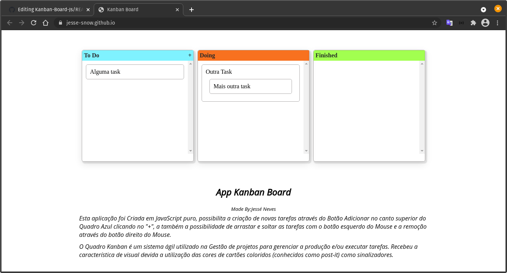

# Kanban Board

That is a project that i have interest in create

## Table of contents

- [Overview](#overview)
  - [Screenshot](#screenshot)
  - [Links](#links)
- [My process](#my-process)
  - [Built with](#built-with)
  - [What I learned](#what-i-learned)
- [Author](#author)

## Overview

- Create a Kanban Bord, having add button and delete features
- Add drag and drop feature

### Screenshot

### Links

[Preview](https://jesse-snow.github.io/Kanban-Board-Js)

### Built with

- CSS Flexbox
- HTML5 Drag and Drop API
- JavaScript

### What I learned

- Connect Js and HTML
- Search for the content that i need better

## Author

- GitHub - [@Jesse-Snow](https://github.com/Jesse-Snow/)
